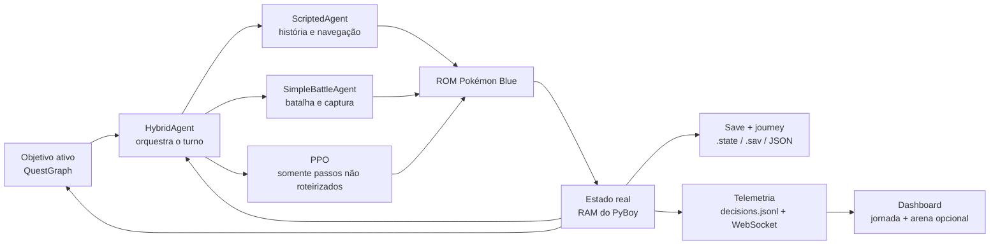

# PokeAI 2026 — mapa visual da jornada

Este documento explica visualmente como o bot progride no Pokémon Blue real.
Ele é uma visão humana do sistema, não uma segunda fonte de verdade.

## Fontes de verdade

| Assunto | Fonte canônica |
|---|---|
| Ordem dos objetivos e predicados de conclusão | `blue-agents/knowledge/quests/main_quest_graph.json` |
| Avaliação dos predicados na RAM | `blue-agents/quest_graph.py` |
| Execução de rotas e eventos | `src/scripted_agent.py` |
| Estado atual e próximo bloqueio | `docs/HANDOFF.md` |
| Prova histórica das decisões | `trainers/<AGENT>/logs/decisions.jsonl` |

Se este desenho divergir do JSON, o JSON vence. Se um nó existir no JSON mas
não possuir executor no código, ele é apenas planejamento: o bot ainda não
sabe concluí-lo sozinho.

## Legenda de cobertura

- **Validado:** executado e confirmado no cartucho real por estado da RAM.
- **Em validação:** executor existe, mas a rota completa ainda não foi provada.
- **Planejado:** objetivo e condição de sucesso existem; executor real falta.

## QuestGraph principal

```mermaid
flowchart TD
    start["01 · Início<br/>Chegar ao laboratório"]
    oak["02 · Evento do Oak<br/>Starter + rival"]
    parcel["03 · Encomenda<br/>Buscar + entregar"]
    balls["04 · Poké Bolas<br/>Comprar após Pokédex"]
    route2["05 · Route 2<br/>Chegar à floresta"]
    forest["06 · Viridian Forest<br/>Chegar a Pewter"]
    pewter["07 · Pewter<br/>Entrar no ginásio"]
    brock["08 · Brock<br/>Boulder Badge"]
    moon["09 · Mt. Moon<br/>Chegar a Cerulean"]
    bill["10 · Bill<br/>Rival + ponte + Ticket"]
    misty["11 · Cerulean<br/>Misty"]
    surge["12 · Vermilion<br/>Cut + Lt. Surge"]
    erika["13 · Celadon<br/>Rocket + Erika"]
    koga["14 · Fuchsia<br/>Surf + Koga"]
    sabrina["15 · Saffron<br/>Silph + Sabrina"]
    blaine["16 · Cinnabar<br/>Blaine"]
    giovanni["17 · Viridian<br/>Giovanni"]
    league["18 · Liga<br/>Elite Four + Campeão"]
    mewtwo["19 · Pós-jogo<br/>Mewtwo"]

    start --> oak --> parcel --> balls --> route2 --> forest --> pewter --> brock
    brock --> moon --> bill --> misty --> surge --> erika --> koga --> sabrina
    sabrina --> blaine --> giovanni --> league --> mewtwo

    classDef validated fill:#163f2c,stroke:#54d18b,color:#f4fff8,stroke-width:2px;
    classDef validating fill:#4a3815,stroke:#f2bf4a,color:#fffaf0,stroke-width:2px;
    classDef planned fill:#292d3a,stroke:#7f8aa3,color:#eef1f7,stroke-width:1px,stroke-dasharray:5 4;

    class start,oak,parcel,balls,route2,forest,pewter,brock,moon,bill,misty validated;
    class surge validating;
    class erika,koga,sabrina,blaine,giovanni,league,mewtwo planned;
```

O checkpoint documentado está no Ginásio de Cerulean depois de Misty. Portanto,
os 11 primeiros nós estão comprovados no cartucho. Lt. Surge é o objetivo ativo
e seu executor é o próximo trabalho.

## Cobertura nó por nó

| # | ID | Conclusão observada na RAM | Executor | Estado |
|---:|---|---|---|---|
| 1 | `start` | flag `0xD74B`, bit 1 | fluxo legado de início | Validado |
| 2 | `oak_event` | flag `0xD74B`, bit 3 | fluxo legado de Oak/rival | Validado |
| 3 | `parcel_event` | flag `0xD74B`, bit 5 | `_run_parcel_event` | Validado |
| 4 | `buy_pokeballs` | ao menos 1 Poké Bola real | `_run_buy_pokeballs` | Validado |
| 5 | `route_2_nav` | mapa 51 | `_run_route_2_nav` | Validado |
| 6 | `viridian_forest_nav` | mapa 2 ou 54 | `_run_viridian_forest_nav` | Validado |
| 7 | `pewter_city_nav` | mapa 54 | `_run_pewter_city_nav` | Validado |
| 8 | `brock_quest` | insígnia 0 | `_run_brock_quest` | Validado |
| 9 | `mt_moon_nav` | mapa 3 ou 65 | `_run_mt_moon_nav` | Validado |
| 10 | `bill_quest` | S.S. Ticket (`0x3F`) | `_run_bill_quest` | Validado |
| 11 | `cerulean_gym_quest` | insígnia 1 | `_run_cerulean_gym_quest` | Validado |
| 12 | `vermilion_gym_quest` | insígnia 2 | ausente | Em validação |
| 13 | `celadon_story_quest` | insígnia 3 | ausente | Planejado |
| 14 | `fuchsia_story_quest` | insígnia 4 | ausente | Planejado |
| 15 | `saffron_story_quest` | insígnia 5 | ausente | Planejado |
| 16 | `cinnabar_story_quest` | insígnia 6 | ausente | Planejado |
| 17 | `viridian_gym_quest` | insígnia 7 | ausente | Planejado |
| 18 | `pokemon_league_quest` | flag `0xD867`, bit 1 | ausente | Planejado |
| 19 | `mewtwo_postgame` | flag `0xD85F`, bit 1 | ausente | Planejado |

## Como uma decisão vira progresso

O executor envia botões; ele não declara sucesso. Depois de cada avanço, o
`QuestGraph` volta a ler a RAM. Só quando o predicado do nó é verdadeiro o
objetivo entra na lista persistente de concluídos e o próximo é ativado.

## Como estender o grafo sem perder qualidade

Para implementar um nó planejado:

1. mantenha ou refine o predicado real no JSON;
2. adicione `_run_<executor>` em `src/scripted_agent.py`;
3. cubra entradas alternativas, cura, diálogos, batalhas e whiteout;
4. teste a regra sem editar RAM para forçar conclusão;
5. valide no cartucho até o predicado ficar verdadeiro;
6. atualize a classe visual e a tabela deste documento;
7. registre checkpoint, comando de retomada e próximo bloqueio no handoff.

Não marque um nó como validado apenas porque existe uma rota, um teste unitário
passa ou o botão correto parece ter sido pressionado. A prova final é o estado
real do jogo e o save recuperável.
